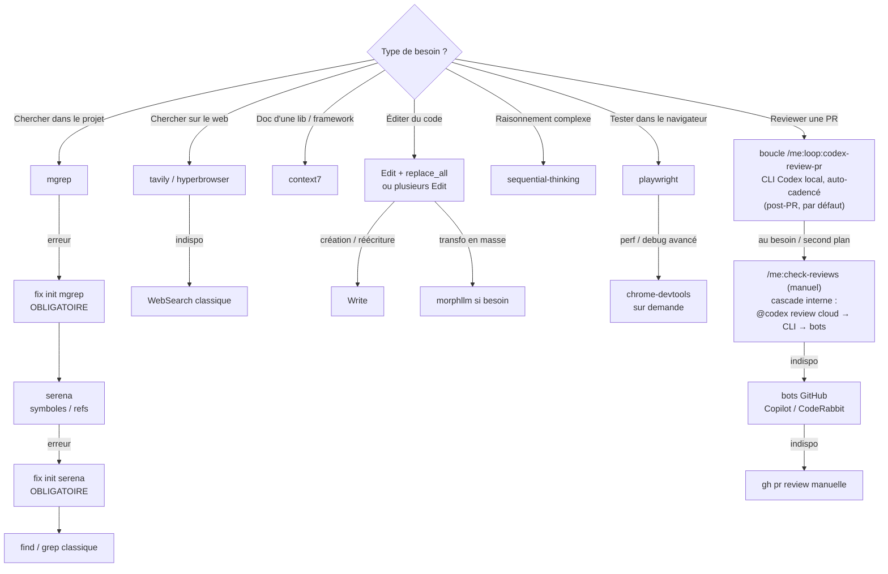
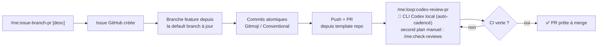
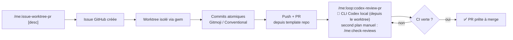
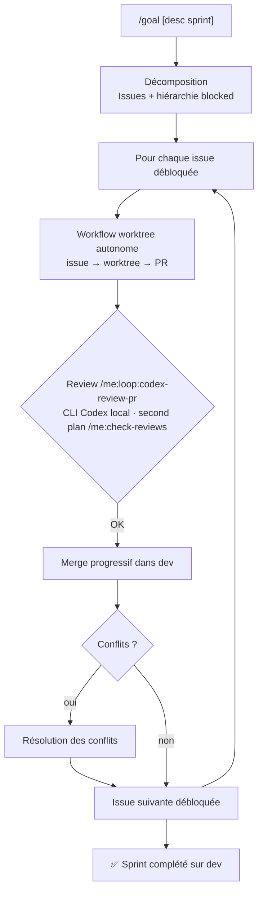
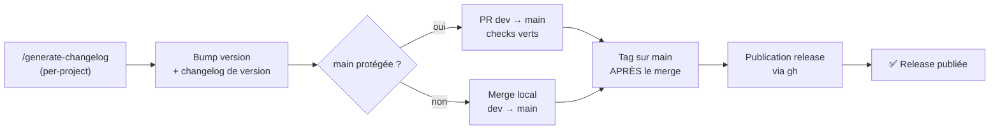
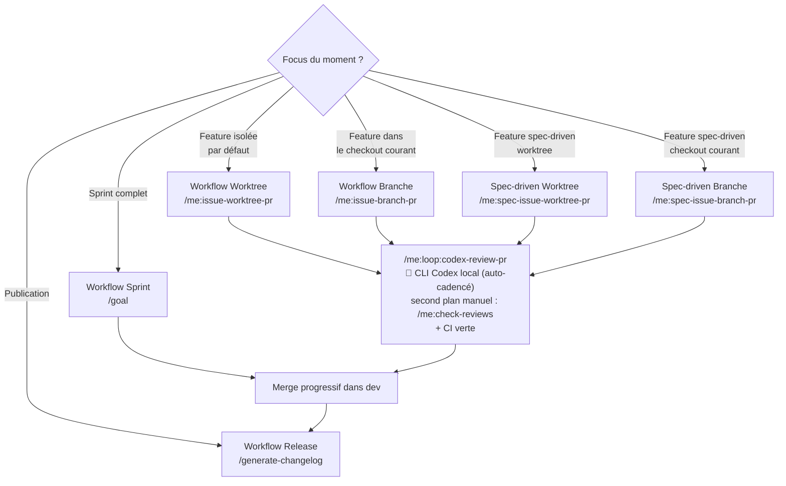
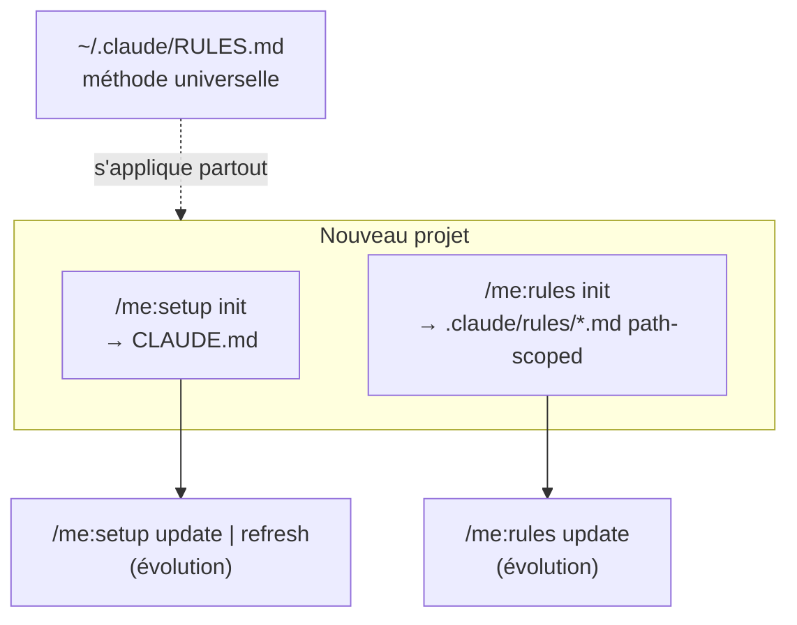

# WORKFLOW w/ Claude Code

> Ma façon de travailler avec Claude Code — outils, cascades de priorité et workflows Git.
> Dernière mise à jour : 2026-06-19.

---

## 🧰 Outils & priorités

| Domaine | Priorité 1 | Priorité 2 | Fallback |
|---------|-----------|-----------|----------|
| **Recherche projet** | `mgrep` *(fix init si erreur — obligatoire)* | `serena` (symboles / refs / LSP, fix init si erreur) | `find` / `grep` classique |
| **Recherche web** | `tavily` | `hyperbrowser` | `WebSearch` classique |
| **Docs dev** | `context7` (libs, frameworks, SDK, CLI) | — | — |
| **Édition de code** | `Edit` + `replace_all` (renommage) | plusieurs `Edit` batchés | `Write` (création/réécriture) |
| **Transfo. de code en masse** | `morphllm` (morph-mcp, fast-apply) *si besoin* | — | — |
| **Analyse / raisonnement** | `sequential-thinking` *au besoin* | — | — |
| **Navigateur / E2E** | `playwright` *au besoin* | `chrome-devtools` *(sur demande)* | — |
| **Review de code (PR)** | boucle `/me:loop:codex-review-pr` (CLI Codex local, auto-cadencé, post-PR) | `/me:check-reviews` *(second plan, déclenché manuellement selon le besoin)* — cascade interne cloud/CLI/bots | bots GitHub (Copilot / CodeRabbit) — `gh pr review` manuelle |
| **Worktrees** | `gwm` (gwm-cli) — **indispensable** | — | — |

### Cascade de décision des outils

---

## 🌿 Workflow — Branche (dans le checkout courant)

> Quand je suis focus sur une **feature / fix / hotfix / chore** sans worktree.

**Commande :** `/me:issue-branch-pr [desc]`
**Puis :** review via la boucle `/me:loop:codex-review-pr` (CLI Codex local, auto-cadencé, corrige jusqu'à 0 finding bloquant pertinent) + CI verte. Au besoin, je déclenche `/me:check-reviews [PR#]` manuellement en second plan (cascade interne cloud/CLI/bots).

---

## 🌳 Workflow — Worktree (classique / par défaut)

> Mon mode **par défaut** quand je suis focus sur une feature / fix / hotfix / chore.

**Commande :** `/me:issue-worktree-pr [desc]`
**Puis :** review via la boucle `/me:loop:codex-review-pr` (CLI Codex local, auto-cadencé, corrige jusqu'à 0 finding bloquant pertinent) — **lancée depuis le worktree** — + CI verte. Au besoin, je déclenche `/me:check-reviews [PR#]` manuellement en second plan (cascade interne cloud/CLI/bots).

📁 *Réf. : `fiches-pedagogiques-front/`, `fiches-pedagogiques-api-rest/`*

---

## 🧬 Workflow — Spec-driven (Spec Kit)

> Variante **issue-first + spec-driven** des workflows Branche/Worktree : pour une feature qui mérite une spec écrite (`specify → plan → tasks`) **avant** de coder, puis une implémentation pilotée par les tâches (`implement`).

**Commandes :**
- **Worktree** : `/me:spec-issue-worktree-pr [desc]` → skill `spec-git-flow-worktree`
- **Branche** : `/me:spec-issue-branch-pr [desc]` → skill `spec-git-flow-branch`

**Principe issue-first** : le n° d'issue GitHub pilote la branche (`<type>/#N-slug`, créée par **gwm**/git) **et** le spec dir (`N-slug`, créé par **speckit**). `speckit.specify` tourne en **`--no-branch`** (gwm/git possède déjà la branche) avec `--number N` → la résolution downstream (`feature.json` + préfixe) garde issue = branche = spec.
**Prérequis** : `.specify/` présent dans le repo (sinon `/speckit.install`).
**Boucle optionnelle** : `speckit.converge` → réinjecte les écarts spec↔code en tâches, puis `speckit.implement` à nouveau.
**Puis :** review via la boucle `/me:loop:codex-review-pr` (depuis le worktree en mode worktree) + CI verte.

📁 *Réf. : repos avec Spec Kit installé (`.specify/`)*

```mermaid
flowchart LR
    A["/me:spec-issue-worktree-pr [desc]"] --> B[Issue GitHub créée #N]
    B --> C[Worktree gwm<br/>feat/#N-slug]
    C --> D["speckit.specify --no-branch --number N<br/>→ .specify/specs/N-slug/"]
    D --> E[speckit.plan → speckit.tasks<br/>+ hydratation Claude Tasks]
    E --> F["speckit.implement<br/>(+ speckit.converge optionnel)"]
    F --> G[Commits atomiques<br/>artefacts spec + code]
    G --> H[Push + PR<br/>Closes #N]
    H --> I["/me:loop:codex-review-pr<br/>(depuis le worktree)"]
    I --> J{CI verte ?}
    J -->|non| I
    J -->|oui| K[✅ PR prête à merge]
```

> En mode **branche**, remplace l'étape worktree par `git checkout -b feat/#N-slug` depuis la default branch à jour (working tree clean requis), et lance la review directement (pas de `cd` worktree).

---

## 🎯 Workflow — Sprint (`/goal`)

> Quand je suis focus sur un **sprint** complet (issues + hiérarchie avec dépendances `blocked`).

**Commande :** `/goal [desc sprint avec issues et hiérarchie blocked]`
Utilise le **workflow worktree autonome**, merge progressivement dans `dev` après review (boucle `/me:loop:codex-review-pr` — CLI Codex local — prioritaire ; `/me:check-reviews` en second plan manuel), et résout les conflits.

📁 *Réf. : `gwm-cli/`, `LazyCurl-rs/`*

---

## 🚀 Workflow — Release

> Publication d'une version.

**Commande :** `/generate-changelog` *(per-project)* → bump version → merge `dev` → `main` → **tag** → release `gh`.

⚠️ **Le tag vient APRÈS le merge sur `main`**, jamais avant : il doit pointer le commit qui porte déjà le bump de version et le changelog de la version, sinon la publication n'est pas reproductible depuis le tag.

🔒 **Si `main` est protégée** (PR + status checks requis — c'est le cas de `gwm-cli`) : le merge `dev` → `main` passe par une **PR**, pas par un merge local direct. Attendre les checks verts, merger en **merge commit**, puis tagger le merge commit sur `main`. Avec `enforce_admins`, l'admin n'a aucune échappatoire : `git push origin main` est rejeté, il n'y a pas de plan B en urgence. Vérifier avant de cut : `gh api repos/<owner>/<repo>/branches/main/protection`.

📁 *Réf. : `gwm-cli/` (main protégée), `fiches-pedagogiques-front/`, `fiches-pedagogiques-api-rest/`*

---

## 🗺️ Vue d'ensemble

---

## 📌 Conventions transverses

- **Branches** : feature uniquement, jamais sur `main`/`master` directement.
- **Commits** : atomiques, Gitmoji + Conventional Commits, référencent l'issue.
- **Issue** : remplie depuis le template du repo (`.github/ISSUE_TEMPLATE/*`).
- **PR** : remplie depuis le template du repo (`.github/PULL_REQUEST_TEMPLATE.md`).
- **Reviews** : source par défaut = la boucle **`/me:loop:codex-review-pr`** (CLI Codex local, auto-cadencé, lancée après la PR — **depuis le worktree** en mode worktree — qui corrige jusqu'à 0 finding bloquant pertinent P0/P1, max 5 itérations). En **second plan**, je déclenche **`/me:check-reviews [PR#]`** manuellement selon le besoin (cascade interne : `@codex review` cloud → CLI locaux Codex/CodeRabbit → bots GitHub Copilot/CodeRabbit). On attend la **CI verte** avant merge.
- **Sprint** : merge progressif dans `dev` ; release depuis `main`.
- **Worktrees** : gérés via `gwm` (config `.gwm.toml` par repo).

---

## ⚙️ Configuration & bootstrap projet

Deux niveaux de config, deux commandes :

| Niveau | Fichier(s) | Commande | Contenu |
|--------|-----------|----------|---------|
| **Global** (tous projets) | `~/.claude/RULES.md` | — | Ma méthode universelle (cette doc) : priorités, cascade outils, workflows Git, conventions, honnêteté |
| **Projet** (contexte) | `<repo>/CLAUDE.md` | `/me:setup init\|update\|refresh` | Stack, commandes build/test, structure, rappel des workflows adaptés au repo |
| **Projet** (conventions techniques) | `<repo>/.claude/rules/*.md` | `/me:rules init\|update` | Règles **path-scoped** (`paths:`) chargées selon les fichiers touchés (React, Laravel, Rust…) |
| **Projet** (changelog) | `<repo>/.claude/commands/changelog.md` + `changelog.config.json` | `/me:changelog-create init\|update` | Génère un `/changelog` taillé au projet (verbosité configurable, basé sur `changelog-generator`, range dans `changelogs/`) |

- **`/me:setup`** : `init` (créer), `update` (compléter en préservant le manuel), `refresh` (re-sync stack/commandes/structure).
- **`/me:rules`** : `init` (créer les règles selon le stack détecté), `update` (faire évoluer).
- Les deux suivent la cascade `mgrep → serena → find` + `context7` pour analyser le repo, et restent **evidence-based** (commandes/conventions réelles, jamais inventées).

---

## ✅ Fait récemment

- **Workflows spec-driven `/me:spec-issue-{worktree,branch}-pr`** (2026-06-19) : deux nouveaux workflows **issue-first + Spec Kit**, copies de `/me:issue-{worktree,branch}-pr` avec les phases `speckit.specify → speckit.plan → speckit.tasks` insérées après la création du worktree/branche, puis `speckit.implement` à la place de l'implémentation freeform. Architecture **command → skill** respectée : logique dans les skills `spec-git-flow-worktree` / `spec-git-flow-branch`, commands `commands/me/spec-issue-*-pr.md` = ref léger (idiome `run-loop`). **Audit + MAJ Spec Kit vs `github/spec-kit`** au passage : (1) **découplage de la création de branche** — `create-new-feature.sh` gagne `--no-branch` + auto-skip si déjà sur la branche cible (gwm/git possède la branche, speckit ne fait que le spec dir) ; (2) **`.specify/feature.json`** persisté + lu en priorité par `common.sh::get_feature_paths` (fallback préfixe), auto-git-ignored ; (3) **`speckit.converge`** porté (append-only : réinjecte les écarts spec↔code en tâches). Écartés volontairement (redondants/contre-productifs pour mon modèle) : système extensions/hooks (gwm + commits atomiques le couvrent), presets (pas de CLI Python), timestamp numbering (mon n° = issue GitHub). ⚠️ Les patchs des **scripts** touchent le **scaffold** de `speckit.install` → effet sur les futurs `/speckit.install` ; projets déjà installés = re-run `/speckit.install` (merge) ou patch manuel de `.specify/scripts/bash/`. Non testé end-to-end (à valider au premier run réel sur un repo avec `.specify/`).
- **Review par défaut = boucle CLI Codex local** (2026-06-10) : la source de review par défaut après une PR n'est plus `@codex review` cloud via `/me:check-reviews --auto`, mais la **boucle `/me:loop:codex-review-pr`** (CLI Codex local, auto-cadencé, corrige les findings bloquants pertinents P0/P1 jusqu'à clean, max 5 itérations — lancée **depuis le worktree** en mode worktree). **`/me:check-reviews`** passe en **second plan**, déclenché **manuellement** selon le besoin (il garde sa cascade interne cloud/CLI/bots). Répercuté dans : table d'outils + cascade + 3 workflows (branche/worktree/sprint) + vue d'ensemble + conventions ; et dans les skills/commands `issue-worktree-pr`, `git-flow-worktree`, `setup`. ⚠️ La règle « review depuis le worktree, jamais le checkout principal » devient le chemin **courant** (plus un edge case) car la boucle lit l'arbre local sur la branche courante.
- **Deux pièges du workflow worktree** (2026-06-08, vécus sur `fiches-pedagogiques-api-rest`) :
  - **Review depuis le worktree, pas le checkout principal.** La review Codex qui lit l'arbre local (`/codex:review`, `/me:check-reviews --local`, companion, CodeRabbit CLI) review le **répertoire courant**. Lancée depuis le checkout principal (resté sur `dev` avec d'autres docs/brouillons non commités), elle review le mauvais arbre et remonte du bruit hors PR. → toujours `cd "$(gwm path <slug>)"` avant. Et préférer `--base <branche>` à un scope en texte libre (rejeté par le companion). Documenté dans les skills `git-flow-worktree` (étape 7) et `check-reviews` (Phase 1B).
  - **Drift de version du formatter.** `composer format` télécharge la **dernière** version de Mago ; si elle diffère de celle qui a formaté la branche, elle reformate **tout le repo** (40+ fichiers hors-scope vus en vrai). → vérifier `git status` après format et reverter les fichiers non touchés (`git add` mes fichiers, puis `git checkout -- .`) ; le **hook pre-commit** qui ne formate que le staged est la source de vérité plus sûre. Documenté dans `git-flow-worktree` (étape 4 + garde-fous).
- **`/me:check-reviews` — cascade de review IA** (2026-06-07) : stratégie **cloud d'abord** pour alléger la charge locale. Source par défaut = **`@codex review`** posté en commentaire PR → bot Codex Cloud (charge locale nulle, P0/P1). **Fallback automatique** : CLI locaux **`codex`** (findings JSON `review-output.schema.json`, **garde-fou de branche** obligatoire) puis **`coderabbit review --agent`** en complément, enfin **bots GitHub** Copilot/CodeRabbit. Flags : `--instruction "<texte>"` (passe au tag `@codex review`), `--local` (force les CLI), `--copilot` (force les bots). Motivation : review constante même sans quota Copilot, sans charger la machine. ⚠️ Non testé end-to-end (sorties `@codex` cloud et `coderabbit --agent` à confirmer au premier run réel).
- **Méta-skill `/me:changelog-create`** : génère un `/changelog` par projet (façon `me:skill-create`), basé sur `changelog-generator`, qui remplace `/generate-changelog`. Verbosité **figée à la génération + override par flags** :
  - Entrées *Ajouté / Modifié / Corrigé* : `verbose` / `normal` / `short`
  - Détails de version : `verbose` / `normal` / `short` / `null`
  - Détecte et reproduit le format du repo (réf : `gwm-cli` = Keep a Changelog ; `fiches-pedagogiques` = Flippad + `client/`).

## 💡 Idées / à faire

- _(à compléter au fil de l'eau)_
