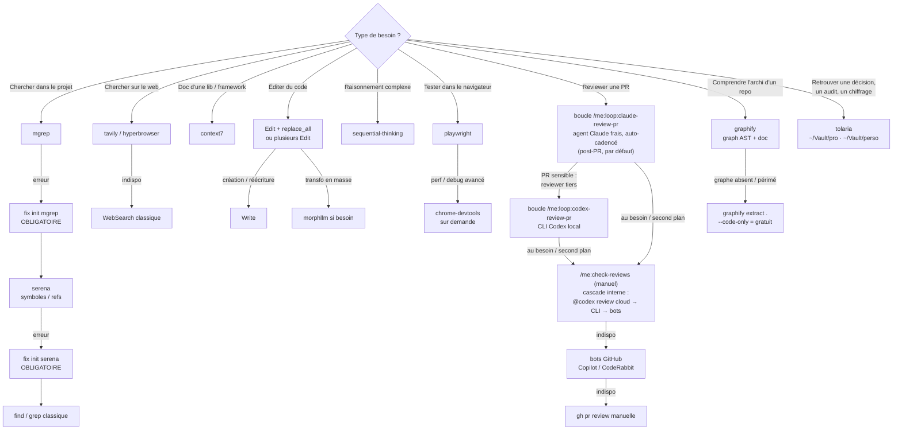
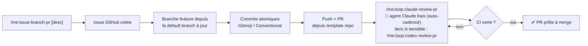
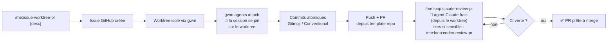
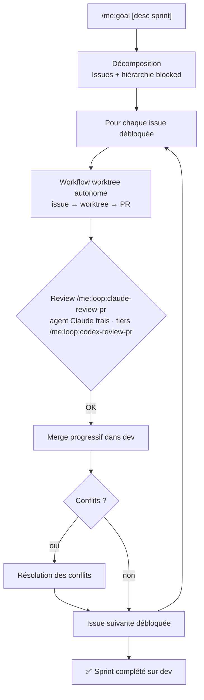
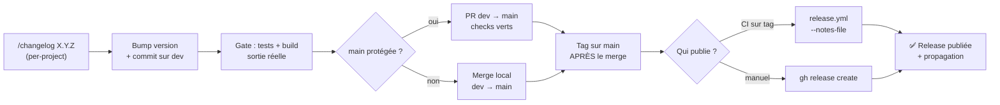
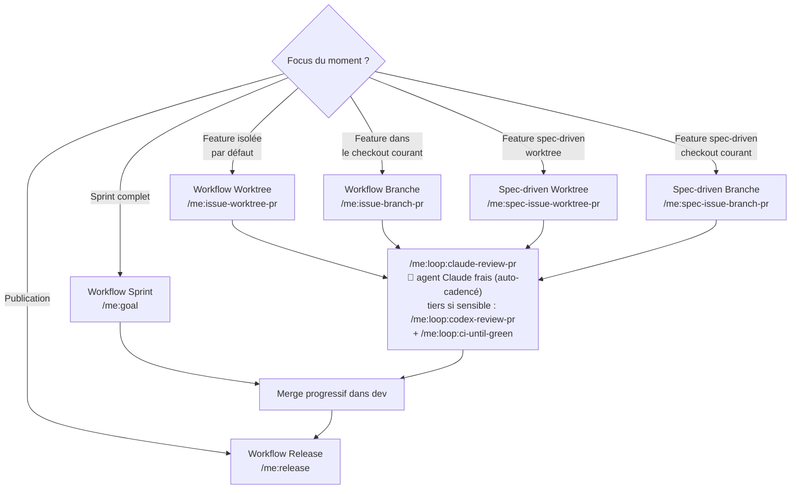
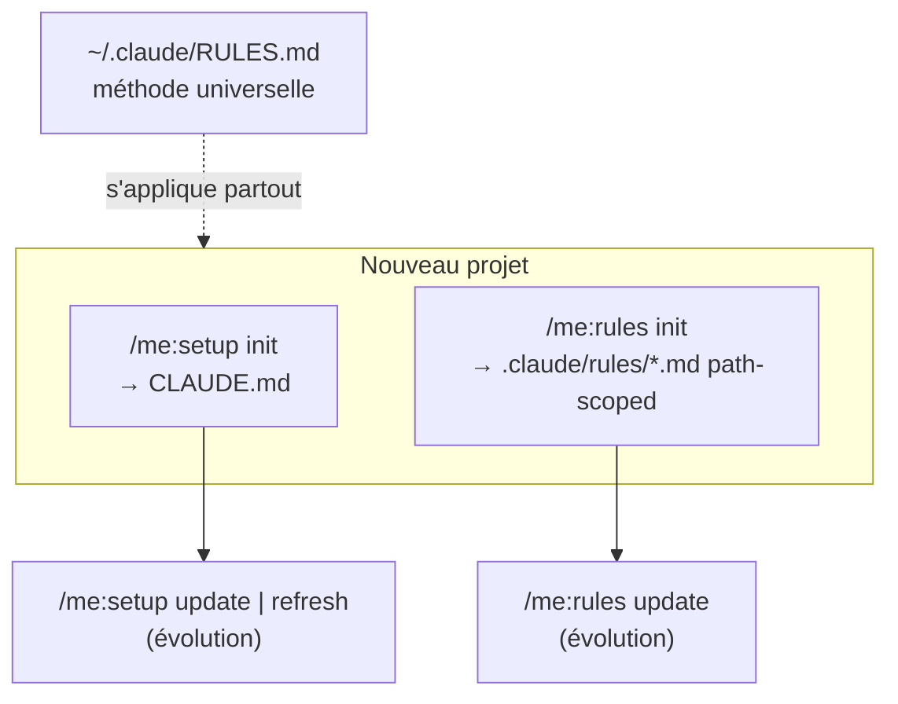

# WORKFLOW w/ Claude Code

> Ma façon de travailler avec Claude Code — outils, cascades de priorité et workflows Git.
> Dernière mise à jour : 2026-07-27.

---

## 🧰 Outils & priorités

| Domaine | Priorité 1 | Priorité 2 | Fallback |
|---------|-----------|-----------|----------|
| **Recherche projet** | `mgrep` *(fix init si erreur — obligatoire)* | `serena` (symboles / refs / LSP, fix init si erreur) | `find` / `grep` classique |
| **Recherche web** | `tavily` | `hyperbrowser` | `WebSearch` classique |
| **Docs dev** | `context7` (libs, frameworks, SDK, CLI) | — | — |
| **Édition de code** | `Edit` + `replace_all` (renommage) | plusieurs `Edit` batchés | `Write` (création/réécriture) |
| **Transfo. de code en masse** | `morphllm` (morph-mcp, fast-apply) *si besoin* | — | — |
| **Analyse / raisonnement** | `sequential-thinking` *au besoin* | — | — |
| **Navigateur / E2E** | `playwright` *au besoin* | `chrome-devtools` *(sur demande)* | — |
| **Review de code (PR)** | boucle `/me:loop:claude-review-pr` (agent Claude frais, auto-cadencé, post-PR) | boucle `/me:loop:codex-review-pr` (CLI Codex local — quand il faut un **reviewer tiers**) puis `/me:check-reviews` *(manuel)* | bots GitHub (Copilot / CodeRabbit) — `gh pr review` manuelle |
| **CI verte (PR)** | boucle `/me:loop:ci-until-green` (checks du **SHA exact** de HEAD, corrige la cause racine, max 6) | `gh pr checks --watch` à la main | ~~`watch-ci`~~ *(déprécié : lit la branche, pas le sha ; 3 essais en dur)* |
| **Worktrees** | `gwm` (gwm-cli) — **indispensable** | — | — |
| **Suivi des sessions IA** | `gwm agents attach` après chaque création de worktree | `gwm agents` / pane Agents de la TUI | — |
| **Comprendre une codebase** | `graphify` (graph AST + doc, `graphify-out/graph.json`) | `mgrep` / `serena` | lecture directe |
| **Notes & connaissance** | `tolaria` (MCP multi-vault, `~/Vault/{pro,perso}`) | — | — |

### Cascade de décision des outils


```mermaid
flowchart TD
    Q{Type de besoin ?}

    Q -->|Chercher dans le projet| S1[mgrep]
    S1 -->|erreur| S1f[fix init mgrep<br/>OBLIGATOIRE]
    S1f --> S2[serena<br/>symboles / refs]
    S2 -->|erreur| S2f[fix init serena<br/>OBLIGATOIRE]
    S2f --> S3[find / grep classique]

    Q -->|Chercher sur le web| W1[tavily / hyperbrowser]
    W1 -->|indispo| W2[WebSearch classique]

    Q -->|Doc d'une lib / framework| C1[context7]

    Q -->|Éditer du code| E1[Edit + replace_all<br/>ou plusieurs Edit]
    E1 -->|création / réécriture| E2[Write]
    E1 -->|transfo en masse| E3[morphllm si besoin]

    Q -->|Raisonnement complexe| A1[sequential-thinking]
    Q -->|Tester dans le navigateur| B1[playwright]
    B1 -->|perf / debug avancé| B2[chrome-devtools<br/>sur demande]

    Q -->|Reviewer une PR| R1["boucle /me:loop:claude-review-pr<br/>agent Claude frais, auto-cadencé<br/>(post-PR, par défaut)"]
    R1 -->|PR sensible :<br/>reviewer tiers| R1b["boucle /me:loop:codex-review-pr<br/>CLI Codex local"]
    R1b -->|au besoin / second plan| R2["/me:check-reviews (manuel)<br/>cascade interne :<br/>@codex review cloud → CLI → bots"]
    R1 -->|au besoin / second plan| R2
    R2 -->|indispo| R3[bots GitHub<br/>Copilot / CodeRabbit]
    R3 -->|indispo| R4[gh pr review manuelle]

    Q -->|Comprendre l'archi d'un repo| G1["graphify<br/>graph AST + doc"]
    G1 -->|graphe absent / périmé| G2["graphify extract .<br/>--code-only = gratuit"]

    Q -->|Retrouver une décision,<br/>un audit, un chiffrage| T1["tolaria<br/>~/Vault/pro · ~/Vault/perso"]
```

---

## 🧠 Où vit quoi — les 4 emplacements du savoir

> La règle qui évite de tout redoubler. Le vault a été abandonné une première fois
> précisément parce qu'il recopiait ce que git avait déjà.

| Emplacement | Contenu | Outil |
|---|---|---|
| `<repo>/docs/` + le code | comment ça marche | **`graphify`** — `graphify-out/graph.json` |
| `~/Vault/pro`, `~/Vault/perso` | **pourquoi** : décisions, audits, chiffrages, retex, dailies | **`tolaria`** (MCP multi-vault) |
| `~/.claude/projects/*/memory/` | leçons de session, par projet, liées aux issues | **Claude, d'elle-même** — 339 notes, contexte riche, on n'y touche pas |
| git : issues, PR, `changelogs/X.Y.Z.md` | le quoi, daté et versionné | `gh`, `/me:release` |

**Ne jamais écrire dans le vault** : doc technique de repo, changelog, tâche, procédure
(= skill `me:*`). Si git le sait déjà, le vault ne le redit pas.

**Les mémoires Claude restent où elles sont.** Elles vivent leur vie, apportent le contexte
riche par projet, et Claude les lit au démarrage — les déplacer casse ça. Ce qui remonte
dans le vault, c'est la leçon **transverse** (celle qui vaut au-delà d'un repo), promue à
la main en note permanente. C'est le seul chemin qui décloisonne les silos par projet.

### tolaria — l'essentiel opérationnel

- deux vaults **frères**, jamais imbriqués (`assertNotNested` refuse) : `~/Vault/pro` (`kbrdn1/vault-pro`) et `~/Vault/perso` (`kbrdn1/vault-perso`), privés, **hors iCloud**
- MCP multi-vault via `VAULT_PATHS` (tableau JSON, **chemins absolus** — pas d'expansion du `~` sur les env vars). `search_notes` traverse les deux, `get_vault_context` les renvoie séparément
- ⛔ **tolaria ne suit pas les symlinks** : un dossier symlinké est invisible (ni indexé ni cherchable), un fichier symlinké est indexé mais `get_note` le rejette (`Note path must stay inside the active vault`). Vérifié sur 2026.8.19, cf. issue #234 fermée mais toujours vivante. **Donc pas de `<repo>/docs` symlinké dans un vault** — c'est le rôle de graphify. Les deux vaults actuels en contiennent **zéro**, la question est close par construction.
- ⚠️ **la config MCP qui compte est `~/.claude.json` → `mcpServers.tolaria`**, pas `~/.claude/mcp.json`. Les deux peuvent exister ; seul le premier est lu par Claude Code. Éditer le mauvais donne un `/mcp` reconnect qui remonte l'ancien vault sans erreur.
- ✅ rendu desktop validé sur `v2027-08-28` (le sidecar MCP de cette build est cassé et patché à part, voir plus bas — l'app Rust, elle, va bien)
- ⛔ **YAML strict** : toute valeur de chaîne quotée, **aucune syntaxe Templater** dans le frontmatter — une seule note cassée faisait échouer `get_vault_context` sur tout le vault
- `type` obligatoire : `project` (début/fin) · `responsibility` (pas de fin) · `procedure` · `note` · `reference` · `daily`
- l'`AGENTS.md` à la racine de chaque vault est exposé au LLM (`hasAgentInstructions`) — **c'est lui qui porte les conventions détaillées**, pas ce fichier : structure, frontmatter, nommage, templates
- ⚠️ **l'app tolaria auto-commite le vault** sous ses propres libellés (`Update 9 notes in <dossier>`), signés à mon nom. Si j'édite hors de l'app, mes messages de commit m'échappent — faire le `git commit` avant que l'app ne ramasse, ou accepter le libellé générique
- couper le pro : `mounted: false` dans `vaults.json` le sort de la recherche et du contexte

**Structure retenue — découpage par produit, pas par org ni par client.** Une note descend au
niveau le plus précis qui reste vrai ; en cas de doute, monter d'un cran (trop bas = invisible
depuis les autres dépôts concernés, trop haut = trouvable quand même).

| Portée | Vault pro | Vault perso |
|---|---|---|
| un dépôt / projet | `<produit>/<dépôt>/<famille>/` | `01 - Projects/<projet>/<famille>/` |
| plusieurs dépôts d'un produit | `<produit>/<famille>/` | `01 - Projects/<famille>/` |
| plusieurs produits d'un client | `05 - Clients/<client>/<famille>/` | — |
| toute l'organisation | `04 - Flippad/<famille>/` | — |
| au-delà de tout projet | — | `04 - Permanent/` |

Familles : `audits/` (état des lieux daté), `decisions/` (arbitrage + ce qui a été écarté +
retex après exécution), `integrations/` (faisabilité d'un tiers, ancrée à un `codebase_head`).
Les dossiers se créent **à la première note** — pas de scaffolding vide, tolaria ne les affiche
pas et git ne les versionne pas.

Un template par famille dans `99 - Meta/`, typés `procedure` avec leur frontmatter cible dans
un bloc ` ```yaml ` — sinon ils comptent comme de faux audits dans les types et la recherche.
Toute note de `audits/`/`decisions/`/`integrations/` ouvre sur un bloc `> **Produit** · dépôt ·
date · PR` dérivé du frontmatter : lue seule, elle doit dire à quoi elle appartient.
- ⚠️ **après chaque auto-update de tolaria** : `~/.claude/scripts/tolaria-mcp-repatch.sh`. La release `v2027-08-28` livre un bundle CJS où esbuild a perdu `import.meta.url` (`var import_meta = {}`) → `new URL("./app-config-policy.json", undefined)` lève `TypeError: Invalid URL` au chargement, le serveur MCP ne démarre plus (et le JSON n'est pas livré non plus). Le script est idempotent : il ne touche rien si le bundle est sain, sinon il backup, patche et vérifie. À supprimer quand l'upstream aura corrigé.

### graphify — l'essentiel opérationnel

```bash
graphify extract . --code-only   # AST tree-sitter local, 0 token, 0 clé API
env -u ANTHROPIC_API_KEY graphify extract . --backend=claude-cli   # + passe LLM via l'abo
graphify label . --backend=claude-cli   # nommage des communautés
graphify update .                # après des commits, gratuit
```

⚠️ **`env -u ANTHROPIC_API_KEY` est obligatoire pour le backend `claude-cli`.** Une clé API
présente dans l'environnement court-circuite le login claude.ai et le CLI sort en 1 :
`claude.ai connectors are disabled because ANTHROPIC_API_KEY … takes precedence over your
claude.ai login`. Sans ça, **tous** les chunks sémantiques échouent (vu en vrai : 9/9 sur
gwm-cli) et la passe docs ne produit rien — le graphe code reste intact, mais tu n'as que
le squelette.

- sortie dans `graphify-out/` : `graph.html`, `GRAPH_REPORT.md`, `graph.json`
- chaque arête est taguée `EXTRACTED` / `INFERRED` / `AMBIGUOUS`
- ⚠️ **toujours depuis la racine du repo, sur `dev`** — jamais depuis `worktrees/`, sinon on indexe le mauvais arbre (même discipline que la review Codex, dans l'autre sens)
- sur un repo d'équipe : `graphify-out/` en **exclude local** (`.git/info/exclude`), pas dans le `.gitignore` versionné — zéro diff, la décision de commiter le graphe reste à l'équipe
- ⛔ **run long = détaché, sinon il meurt avec la session.** Les tâches de fond sont des enfants du process Claude Code : un redémarrage les emporte. Trois runs perdus comme ça sur fp-api-rest avant de comprendre.

  ```bash
  cd <repo> && nohup env -u ANTHROPIC_API_KEY PATH="$HOME/.claude/scripts/nomcp:$PATH" \
    graphify extract . --backend=claude-cli > graphify-out/run.log 2>&1 < /dev/null & disown
  ```

  Vérifier `ppid 1` (rattaché à init) et suivre `tail -f graphify-out/run.log`. ⚠️ `env` veut ses options **avant** les assignations : `env -u VAR PATH=… cmd`, jamais `env PATH=… -u VAR`.
- le **cache incrémental survit aux kills** — vérifié deux fois (164/199 sur gwm-cli, 306/374 sur fp-api-rest). Un run interrompu se relance, il ne se refait pas.
- ⚠️ **les Knowledge Gaps du rapport ne sont pas une todo-list de doc.** Sur fp-api-rest, 4242 des 4599 nœuds isolés sont du bruit AST (`.setUp()`, `.__construct()`, dépendances Composer). Seuls les ~179 nœuds `file_type: document` orphelins ont un signal, et le lot est encore pollué (`robots.txt`, templates d'issue, entrées de changelog). Le rapport compte 843, mes calculs 4599 — la définition diffère, ne pas citer le chiffre sans le recalculer.
- ce qui est **réellement solide** dans le rapport : les God Nodes (abstractions centrales, mesurées), les import cycles, les communautés navigables, le taux EXTRACTED. Le nommage des communautés, lui, retombe sur le nœud-hub même en Opus avec la passe docs complète — faiblesse de l'outil, pas du corpus.

---

## 🌿 Workflow — Branche (dans le checkout courant)

> Quand je suis focus sur une **feature / fix / hotfix / chore** sans worktree.

**Commande :** `/me:issue-branch-pr [desc]`
**Puis :** review via la boucle `/me:loop:claude-review-pr` (agent Claude frais, auto-cadencé, corrige jusqu'à 0 finding bloquant pertinent) + `/me:loop:ci-until-green`. PR sensible → doubler avec `/me:loop:codex-review-pr` (reviewer tiers). Au besoin, `/me:check-reviews [PR#]` en second plan manuel.


```mermaid
flowchart LR
    A["/me:issue-branch-pr [desc]"] --> B[Issue GitHub créée]
    B --> C[Branche feature depuis<br/>la default branch à jour]
    C --> D[Commits atomiques<br/>Gitmoji / Conventional]
    D --> E[Push + PR<br/>depuis template repo]
    E --> G["/me:loop:claude-review-pr<br/>🔁 agent Claude frais (auto-cadencé)<br/>tiers si sensible : /me:loop:codex-review-pr"]
    G --> H{CI verte ?}
    H -->|non| G
    H -->|oui| I[✅ PR prête à merge]
```

---

## 🌳 Workflow — Worktree (classique / par défaut)

> Mon mode **par défaut** quand je suis focus sur une feature / fix / hotfix / chore.

**Commande :** `/me:issue-worktree-pr [desc]`
**Juste après la création du worktree :** `gwm agents attach <slug> <session-id>` — la session a démarré depuis le checkout principal (en général `dev`), donc gwm l'attribue **là** et le worktree où elle bosse vraiment n'affiche aucun agent. Le pin corrige l'attribution ; c'est exactement ce pour quoi `attach` existe.
**Puis :** review via la boucle `/me:loop:claude-review-pr` (agent Claude frais, auto-cadencé, corrige jusqu'à 0 finding bloquant pertinent) — **lancée depuis le worktree** — + `/me:loop:ci-until-green`. PR sensible → doubler avec `/me:loop:codex-review-pr` (reviewer tiers). Au besoin, `/me:check-reviews [PR#]` en second plan manuel.

📁 *Réf. : `fiches-pedagogiques-front/`, `fiches-pedagogiques-api-rest/`*


```mermaid
flowchart LR
    A["/me:issue-worktree-pr [desc]"] --> B[Issue GitHub créée]
    B --> C[Worktree isolé via gwm]
    C --> CA["gwm agents attach<br/>🔗 la session se pin<br/>sur le worktree"]
    CA --> D[Commits atomiques<br/>Gitmoji / Conventional]
    D --> E[Push + PR<br/>depuis template repo]
    E --> G["/me:loop:claude-review-pr<br/>🔁 agent Claude frais (depuis le worktree)<br/>tiers si sensible : /me:loop:codex-review-pr"]
    G --> H{CI verte ?}
    H -->|non| G
    H -->|oui| I[✅ PR prête à merge]
```

---

## 🧬 Workflow — Spec-driven (Spec Kit)

> Variante **issue-first + spec-driven** des workflows Branche/Worktree : pour une feature qui mérite une spec écrite (`specify → plan → tasks`) **avant** de coder, puis une implémentation pilotée par les tâches (`implement`).

**Commandes :**
- **Worktree** : `/me:spec-issue-worktree-pr [desc]` → skill `spec-git-flow-worktree`
- **Branche** : `/me:spec-issue-branch-pr [desc]` → skill `spec-git-flow-branch`

**Principe issue-first** : le n° d'issue GitHub pilote la branche (`<type>/#N-slug`, créée par **gwm**/git) **et** le spec dir (`N-slug`, créé par **speckit**). `speckit.specify` tourne en **`--no-branch`** (gwm/git possède déjà la branche) avec `--number N` → la résolution downstream (`feature.json` + préfixe) garde issue = branche = spec.
**Prérequis** : `.specify/` présent dans le repo (sinon `/speckit.install`).
**Boucle optionnelle** : `speckit.converge` → réinjecte les écarts spec↔code en tâches, puis `speckit.implement` à nouveau.
**Puis :** review via la boucle `/me:loop:claude-review-pr` (depuis le worktree en mode worktree) + `/me:loop:ci-until-green`.

📁 *Réf. : repos avec Spec Kit installé (`.specify/`)*


```mermaid
flowchart LR
    A["/me:spec-issue-worktree-pr [desc]"] --> B[Issue GitHub créée #N]
    B --> C[Worktree gwm<br/>feat/#N-slug]
    C --> CA["gwm agents attach<br/>🔗 pin de la session"]
    CA --> D["speckit.specify --no-branch --number N<br/>→ .specify/specs/N-slug/"]
    D --> E[speckit.plan → speckit.tasks<br/>+ hydratation Claude Tasks]
    E --> F["speckit.implement<br/>(+ speckit.converge optionnel)"]
    F --> G[Commits atomiques<br/>artefacts spec + code]
    G --> H[Push + PR<br/>Closes #N]
    H --> I["/me:loop:claude-review-pr<br/>(depuis le worktree)"]
    I --> J{CI verte ?}
    J -->|non| I
    J -->|oui| K[✅ PR prête à merge]
```

> En mode **branche**, remplace l'étape worktree par `git checkout -b feat/#N-slug` depuis la default branch à jour (working tree clean requis), et lance la review directement (pas de `cd` worktree).

---

## 🎯 Workflow — Sprint (`/me:goal`)

> Quand je suis focus sur un **sprint** complet (issues + hiérarchie avec dépendances `blocked`).

⚠️ **Renommé `/goal` → `/me:goal` (2026-09-07)** : `/goal` est depuis la 2.1.139 une **commande native** de Claude Code (condition de complétion évaluée par un modèle qui ne lit que le transcript). Rien à voir avec ce workflow. Le nom est pris, on ne le réutilise pas.

**Commande :** `/me:goal [desc sprint avec issues et hiérarchie blocked]`
Utilise le **workflow worktree autonome**, merge progressivement dans `dev` après review (boucle `/me:loop:claude-review-pr` — agent Claude frais — prioritaire ; `/me:loop:codex-review-pr` si reviewer tiers voulu ; `/me:check-reviews` en second plan manuel), et résout les conflits.

📁 *Réf. : `gwm-cli/`, `LazyCurl-rs/`*


```mermaid
flowchart TD
    A["/me:goal [desc sprint]"] --> B[Décomposition<br/>Issues + hiérarchie blocked]
    B --> C[Pour chaque issue débloquée]
    C --> D[Workflow worktree autonome<br/>issue → worktree → PR]
    D --> E{Review /me:loop:claude-review-pr<br/>agent Claude frais · tiers /me:loop:codex-review-pr}
    E -->|OK| F[Merge progressif dans dev]
    F --> G{Conflits ?}
    G -->|oui| H[Résolution des conflits]
    H --> I
    G -->|non| I[Issue suivante débloquée]
    I --> C
    I --> J[✅ Sprint complété sur dev]
```

---

## 🚀 Workflow — Release

> Publication d'une version.

**Commande :** `/me:release [X.Y.Z | patch | minor | major]` — skill `me:release`, protocole générique. Le `/changelog` du projet (généré par `/me:changelog-create`) reste l'**étape 1** ; le skill couvre tout ce qui vient après. **Si le repo a son propre `/release`, il fait foi** (réf. `bijouterie-julian`).

⛔ **Le bump et la migration du changelog sont des commits** → ils naissent sur `dev`, jamais sur `main`. Direction unique : `feature → dev → main → (preprod → prod)`.

⚠️ **Le tag vient APRÈS le merge sur `main`**, jamais avant : il doit pointer le commit qui porte déjà le bump de version et le changelog de la version, sinon la publication n'est pas reproductible depuis le tag.

🔒 **Si `main` est protégée** (PR + status checks requis — c'est le cas de `gwm-cli`) : le merge `dev` → `main` passe par une **PR**, pas par un merge local direct. Attendre les checks verts, merger en **merge commit**, puis tagger le merge commit sur `main`. Avec `enforce_admins`, l'admin n'a aucune échappatoire : `git push origin main` est rejeté, il n'y a pas de plan B en urgence. Vérifier avant de cut : `gh api repos/<owner>/<repo>/branches/main/protection`.

⚠️ **Qui publie la release change selon le repo** — se tromper double-publie ou ne publie rien :

| Knob | `gwm-cli` | `bijouterie-julian` |
|---|---|---|
| Fichiers de version | `Cargo.toml` + `Cargo.lock` | `config/version.php` (vérité) + `package.json` |
| Fichier de version du changelog | `changelogs/X.Y.Z.md` (sans `v`) | `changelogs/vX.Y.Z.md` |
| `dev` → `main` | PR (main protégée) | merge local (merge commit) |
| Publication | **CI sur tag `v*`** (`release.yml`, `--notes-file`) | **manuelle** (`gh release create`) |
| Gate | `cargo test` + CI | `make build` + tests **via Docker** (CI désactivée) |
| Post-release | homebrew/scoop (CI), sync docs + ROADMAP | propagation preprod, Project board |

Invariants dans les deux cas : `CHANGELOG.md` racine = `[Unreleased]` seule + index `## Past releases` ; un fichier par version sous `changelogs/` ; titre de release = **`vX.Y.Z` seul** ; notes = `--notes-file changelogs/<version>.md` ; la release est un **snapshot** (corriger après coup → `gh release edit --notes-file`).

📁 *Réf. : `gwm-cli/` (main protégée, release par la CI), `bijouterie-julian/` (`/release` per-project), `fiches-pedagogiques-front/`, `fiches-pedagogiques-api-rest/`*


```mermaid
flowchart LR
    A["/changelog X.Y.Z<br/>(per-project)"] --> B[Bump version<br/>+ commit sur dev]
    B --> V[Gate : tests + build<br/>sortie réelle]
    V --> C{main protégée ?}
    C -->|oui| D[PR dev → main<br/>checks verts]
    C -->|non| E[Merge local<br/>dev → main]
    D --> F[Tag sur main<br/>APRÈS le merge]
    E --> F
    F --> G{Qui publie ?}
    G -->|CI sur tag| G1[release.yml<br/>--notes-file]
    G -->|manuel| G2[gh release create]
    G1 --> H[✅ Release publiée<br/>+ propagation]
    G2 --> H
```

---

## 🗺️ Vue d'ensemble


```mermaid
flowchart TD
    DEV{Focus du moment ?}

    DEV -->|Feature isolée<br/>par défaut| WT["Workflow Worktree<br/>/me:issue-worktree-pr"]
    DEV -->|Feature dans<br/>le checkout courant| BR["Workflow Branche<br/>/me:issue-branch-pr"]
    DEV -->|Feature spec-driven<br/>worktree| SWT["Spec-driven Worktree<br/>/me:spec-issue-worktree-pr"]
    DEV -->|Feature spec-driven<br/>checkout courant| SBR["Spec-driven Branche<br/>/me:spec-issue-branch-pr"]
    DEV -->|Sprint complet| SP["Workflow Sprint<br/>/me:goal"]
    DEV -->|Publication| RE["Workflow Release<br/>/me:release"]

    WT --> RV["/me:loop:claude-review-pr<br/>🔁 agent Claude frais (auto-cadencé)<br/>tiers si sensible : /me:loop:codex-review-pr<br/>+ /me:loop:ci-until-green"]
    BR --> RV
    SWT --> RV
    SBR --> RV
    SP --> MERGE[Merge progressif dans dev]
    RV --> MERGE
    MERGE --> RE
```

---

## 📌 Conventions transverses

- **Branches** : feature uniquement, jamais sur `main`/`master` directement.
- **Commits** : atomiques, Gitmoji + Conventional Commits, référencent l'issue.
- **Issue** : remplie depuis le template du repo (`.github/ISSUE_TEMPLATE/*`).
- **PR** : remplie depuis le template du repo (`.github/PULL_REQUEST_TEMPLATE.md`).
- **Reviews** : source par défaut = la boucle **`/me:loop:claude-review-pr`** (agent Claude spawné en contexte **frais**, auto-cadencé, lancée après la PR — **depuis le worktree** en mode worktree — qui corrige jusqu'à 0 finding bloquant pertinent P0/P1/P2, max 8 itérations, avec analyse de convergence). ⚠️ Le reviewer est du **même modèle que la session** : moins de diversité adversariale qu'un tiers, il partage les angles morts. Sur une **PR sensible** (sécurité, argent, multi-tenant, migration de données), doubler avec **`/me:loop:codex-review-pr`** (CLI Codex local, reviewer tiers). En **second plan**, **`/me:check-reviews [PR#]`** manuellement (cascade interne : `@codex review` cloud → CLI locaux Codex/CodeRabbit → bots GitHub Copilot/CodeRabbit). Puis **`/me:loop:ci-until-green`** avant merge.
- **Notes** : au **merge de PR**, une note dans `~/Vault/pro` (ou `perso`) — pourquoi cette solution, ce que la review a attrapé qui vaut au-delà de la PR, ce qui est reporté. C'est le seul moment où le contexte est frais et où git ne le garde pas. Jamais au commit.
- **Codebase** : avant de plonger dans un repo qu'on ne connaît pas ou plus, `graphify extract . --code-only` (gratuit) puis interroger `graph.json` plutôt que grep à l'aveugle.
- **Sprint** : merge progressif dans `dev` ; release depuis `main`.
- **Release** : `/me:release` (skill `me:release`) — bump + changelog **commités sur `dev`**, merge `dev → main` en merge commit, **tag après le merge**, notes = `changelogs/<version>.md`, titre = `vX.Y.Z` seul. Un `/release` per-project (ex. `bijouterie-julian`) fait foi sur le protocole générique.
- **Worktrees** : gérés via `gwm` (config `.gwm.toml` par repo).
- **Sessions IA** : après chaque `gwm create`, la session courante se pin sur le worktree via `gwm agents attach`. Sans ça, `gwm agents` et le pane Agents de la TUI montrent la session sur le repo principal — l'endroit d'où elle a démarré, pas celui où elle travaille. Claude Code expose l'id exact dans l'environnement :

  ```bash
  gwm agents attach <slug> "$CLAUDE_CODE_SESSION_ID"
  ```

  **Filet automatique** : `~/.claude/scripts/statusline.ts` fait le pin tout seul (`gwm agents attach . <session_id>`, en tâche de fond) dès que la session édite un fichier dans un worktree lié alors que son cwd est ailleurs — exactement le cas que la détection gwm ne peut pas couvrir. Il détache le pin précédent quand la session change de worktree, et le glyphe punaise (`\u{f08d}`) collé au nom du worktree en ligne 2 confirme le pin tel qu'il est réellement en git config (`branch.<b>.gwm-agent-pin`). Le pin manuel reste utile : il arrive *avant* la première édition.

---

## ⚙️ Configuration & bootstrap projet

Deux niveaux de config, deux commandes :

| Niveau | Fichier(s) | Commande | Contenu |
|--------|-----------|----------|---------|
| **Global** (tous projets) | `~/.claude/RULES.md` | — | Ma méthode universelle (cette doc) : priorités, cascade outils, workflows Git, conventions, honnêteté |
| **Projet** (contexte) | `<repo>/CLAUDE.md` | `/me:setup init\|update\|refresh` | Stack, commandes build/test, structure, rappel des workflows adaptés au repo |
| **Projet** (conventions techniques) | `<repo>/.claude/rules/*.md` | `/me:rules init\|update` | Règles **path-scoped** (`paths:`) chargées selon les fichiers touchés (React, Laravel, Rust…) |
| **Projet** (changelog) | `<repo>/.claude/commands/changelog.md` + `changelog.config.json` | `/me:changelog-create init\|update` | Génère un `/changelog` taillé au projet (verbosité configurable, basé sur `changelog-generator`, range dans `changelogs/`) |


```mermaid
flowchart TD
    G["~/.claude/RULES.md<br/>méthode universelle"] -.s'applique partout.-> P
    subgraph P[Nouveau projet]
      S["/me:setup init<br/>→ CLAUDE.md"]
      R["/me:rules init<br/>→ .claude/rules/*.md path-scoped"]
    end
    S --> EVO1["/me:setup update | refresh<br/>(évolution)"]
    R --> EVO2["/me:rules update<br/>(évolution)"]
```

- **`/me:setup`** : `init` (créer), `update` (compléter en préservant le manuel), `refresh` (re-sync stack/commandes/structure).
- **`/me:rules`** : `init` (créer les règles selon le stack détecté), `update` (faire évoluer).
- Les deux suivent la cascade `mgrep → serena → find` + `context7` pour analyser le repo, et restent **evidence-based** (commandes/conventions réelles, jamais inventées).

---

## ✅ Fait récemment

- **Review par défaut = `claude-review-pr` · loop `ci-until-green` · `/goal` → `/me:goal`** (2026-09-07) : trois changements dans le système de loops. **(1) Le reviewer par défaut passe du CLI Codex à l'agent Claude frais** (`/me:loop:claude-review-pr`) — plus de broker, plus de wedge, plus de fallback ; `codex-review-pr` reste pour ce qu'il apporte vraiment, la **diversité adversariale d'un reviewer tiers**, sur les PR sensibles. **(2) Nouveau loop `/me:loop:ci-until-green`**, qui remplace la skill `watch-ci` (dépréciée : elle lit `gh run list` sur la **branche** — donc potentiellement la run d'un commit qui n'est plus HEAD — plafonne à 3 essais en dur et n'a aucune garde anti-faux-vert). Le loop lit les checks du **SHA exact** de HEAD (`repos/{repo}/commits/{sha}/check-runs`), exige que tout soit poussé, ferme les trois faux-verts (checks périmés / zéro check / travail non poussé) et laisse une **fenêtre de décantation** de 2 min pour ne pas confondre « workflow pas encore créé » et « pas de CI ». **(3) `/goal` → `/me:goal`** : `/goal` est une **commande native** depuis la 2.1.139 (condition de complétion jugée par un évaluateur qui ne lit que le **transcript**) — le nom était en collision avec mon workflow sprint, et ce workflow n'existait de toute façon **nulle part** comme fichier. Au passage : `me:run-loop` et `CLAUDE.md` pointaient encore `skills/loop/<name>` → `/loop:<name>` alors que le disque dit `skills/me/loop/` → `/me:loop:` (les 3 descriptions frontmatter annonçaient le mauvais préfixe, or ce sont elles qui pilotent le triggering) ; l'**analyse de convergence** (~80 lignes dupliquées entre les deux loops de review) est extraite dans `skills/me/loop/_shared/convergence.md` ; la **garde anti-faux-propre** (#772/#1008) devient un garde-fou du moteur et un point de validation de `me:create-loop`, au lieu de vivre uniquement dans les deux loops qui l'avaient apprise ; et le gabarit `trigger: stop-hook` gagne une **sentinelle d'armement** — la doc dit noir sur blanc qu'un hook de frontmatter de skill reste enregistré *pour tout le reste de la session*, donc sans sentinelle il relance le `check_command` à chaque `Stop` bien après la fin du loop. ⚠️ `ci-until-green` : pipeline de verdict validé sur données réelles (chemin vert **et** rouge, 20 checks sur `gwm-cli`) et garde « tout poussé » vérifiée ; **le run end-to-end complet n'a pas été fait** — à confirmer au premier usage réel.

- **Vaults tolaria `~/Vault/{pro,perso}` + graphify** (2026-08-28) : le vault Obsidian (282 notes dans iCloud) était **mort depuis juin** — 92 wikilinks pour 282 notes, `04 - Permanent` vide, les « tags » les plus fréquents étaient des couleurs hex fuyant de blocs mermaid, et 132 des 139 notes de `01 - Projects` étaient des copies de `README.md`/`CLAUDE.md` de repos (déjà dérivées : `diff` sort des écarts sur `README.md` et `SECURITY.md`). **Il n'est pas mort, l'écriture avait déménagé** : les vraies notes de juin-juillet sont à la racine des workspaces client (analyses d'intégration, audits d'infra, calculs de charge) et surtout dans **339 mémoires Claude Code** (`~/.claude/projects/*/memory/`, dont 142 gwm-cli et 103 bijouterie-julian) — la courbe des dailies le dit : 7 (nov) → 16 → **19 (jan, pic)** → 13 → 1 → 1 → 0. Deux vaults git **frères** hors iCloud (`kbrdn1/vault-pro`, `kbrdn1/vault-perso`, privés), MCP multi-vault via `VAULT_PATHS`. 12 notes pro **copiées** (pas déplacées) avec frontmatter tolaria, 119 notes perso migrées ciblé. Les mémoires Claude **restent en place** : elles vivent d'elles-mêmes et apportent le contexte riche par projet. ⛔ **Découverte bloquante** : tolaria **ne suit pas les symlinks** — vérifié sur 2026.8.19, source + empirique. Dossier symlinké = invisible (`collectMarkdownFile` teste `isDirectory()`, faux sur un symlink, et le nom ne finit pas par `.md`) ; fichier symlinké = **indexé et cherchable mais `get_note` le rejette** (`realpath` + `isVaultRelativePath`), soit le pire cas, exactement l'issue #234 fermée COMPLETED le 2026-04-24 et contestée depuis par deux users. Les 9 symlinks `01 - Projects/* → <repo>/docs` étaient donc invisibles ; ce rôle passe à **graphify**. ✅ Le bug YAML Templater qui faisait planter `get_vault_context` sur tout le vault (une seule note en cause) est corrigé en 2026.8.19 — mais la règle « valeurs quotées, pas de Templater » reste. ⚠️ Les deux outils sont **pré-1.0** (tolaria en alpha quotidienne, graphify v0.9.51 créé il y a 4 mois, 1142 issues) : rien d'unique ne vit dedans, le vault Obsidian n'est pas supprimé. `search_notes` est du plein-texte basique — bon sur 1-2 termes, il décroche sur une question en langage naturel. Premier run graphify sur `gwm-cli` : 7439 nœuds, 18375 arêtes, 243 communautés, **0 token** en `--code-only` (93 % EXTRACTED) ; le `GRAPH_REPORT.md` est maigre sans la passe docs (les 168 docs sautées sont là où est la valeur « améliorer la doc »), et le nommage des communautés retombe sur le nœud-hub même via `--backend=claude-cli`.

- **Pin gwm automatique + `$CLAUDE_CODE_SESSION_ID`** (2026-08-03) : l'heuristique jq « la session Claude la plus fraîche que gwm voit » disparaît des 4 fichiers qui la portaient — Claude Code expose **`CLAUDE_CODE_SESSION_ID`** dans l'environnement du tool Bash, donc `gwm agents attach <slug> "$CLAUDE_CODE_SESSION_ID"` est exact au lieu d'être deviné. En **filet**, `~/.claude/scripts/statusline.ts` pin la session tout seul : il détectait déjà le worktree réel (dernier fichier édité) et reçoit le `session_id` dans son JSON, donc il lance `gwm agents attach . <sid>` en tâche de fond — **gaté** sur (édition, pas simple lecture) + (cwd dans un autre arbre) + (worktree *lié*), avec détach du pin précédent au changement de worktree. ⚠️ `gwm agents attach` **refuse un id qu'il n'a pas encore détecté** (il lit les artefacts on-disk) : le 1er essai peut perdre la course, d'où un **retry borné à 3 renders** par worktree — au-delà on abandonne, jamais de spawn à chaque render. Le glyphe punaise (`\u{f08d}`) de la ligne 2 lit `branch.<b>.gwm-agent-pin` (la vérité git config), donc il ne ment pas si l'attach échoue. Check : `scripts/statusline-pin.test.sh` (repo + worktree temporaires, shim `gwm` qui échoue au 1er attach, HOME isolé).

- **Skill + command `/me:release`** (2026-07-27) : `/generate-changelog` était un **nom mort** (plus aucun fichier ne le définit depuis `/me:changelog-create`) et la ligne Release de `RULES.md` décrivait l'ordre **inverse** du vrai (`tag → merge` au lieu de `merge → tag`). Remplacé par un skill `me:release` + `commands/me/release.md` (ref léger), dont le protocole est **extrait des deux flows réels** : le `/release` per-project de `bijouterie-julian` (6 étapes, `gh release create` manuel, propagation preprod, Project #20) et le flow observé de `gwm-cli` (commit `🔖 chore(release): vX.Y.Z` sur `dev`, PR `dev → main` car main protégée, tag après merge, release **publiée par la CI** sur le tag `v*` avec `--notes-file changelogs/X.Y.Z.md`). Le skill garde les **invariants** (bump/changelog = commits nés sur `dev` ; `CHANGELOG.md` racine = `[Unreleased]` seule + index ; tag après merge ; titre `vX.Y.Z` seul ; release = snapshot → `gh release edit`) et sort le reste en **table de knobs à détecter** (fichiers de version, préfixe `v`, main protégée, **qui publie**, gate de vérif, post-release). Étape 1 = le `/changelog` du projet, inchangé. Répercuté dans `RULES.md`, `WORKFLOW.md` (section Release + mermaid + vue d'ensemble + conventions), `skills/me/setup` et les `CLAUDE.md` des repos qui citaient l'ancien nom. Non testé sur une vraie release (à valider au prochain cut).
- **Workflows spec-driven `/me:spec-issue-{worktree,branch}-pr`** (2026-06-19) : deux nouveaux workflows **issue-first + Spec Kit**, copies de `/me:issue-{worktree,branch}-pr` avec les phases `speckit.specify → speckit.plan → speckit.tasks` insérées après la création du worktree/branche, puis `speckit.implement` à la place de l'implémentation freeform. Architecture **command → skill** respectée : logique dans les skills `spec-git-flow-worktree` / `spec-git-flow-branch`, commands `commands/me/spec-issue-*-pr.md` = ref léger (idiome `run-loop`). **Audit + MAJ Spec Kit vs `github/spec-kit`** au passage : (1) **découplage de la création de branche** — `create-new-feature.sh` gagne `--no-branch` + auto-skip si déjà sur la branche cible (gwm/git possède la branche, speckit ne fait que le spec dir) ; (2) **`.specify/feature.json`** persisté + lu en priorité par `common.sh::get_feature_paths` (fallback préfixe), auto-git-ignored ; (3) **`speckit.converge`** porté (append-only : réinjecte les écarts spec↔code en tâches). Écartés volontairement (redondants/contre-productifs pour mon modèle) : système extensions/hooks (gwm + commits atomiques le couvrent), presets (pas de CLI Python), timestamp numbering (mon n° = issue GitHub). ⚠️ Les patchs des **scripts** touchent le **scaffold** de `speckit.install` → effet sur les futurs `/speckit.install` ; projets déjà installés = re-run `/speckit.install` (merge) ou patch manuel de `.specify/scripts/bash/`. Non testé end-to-end (à valider au premier run réel sur un repo avec `.specify/`).
- **Review par défaut = boucle CLI Codex local** (2026-06-10) : la source de review par défaut après une PR n'est plus `@codex review` cloud via `/me:check-reviews --auto`, mais la **boucle `/me:loop:codex-review-pr`** (CLI Codex local, auto-cadencé, corrige les findings bloquants pertinents P0/P1 jusqu'à clean, max 5 itérations — lancée **depuis le worktree** en mode worktree). **`/me:check-reviews`** passe en **second plan**, déclenché **manuellement** selon le besoin (il garde sa cascade interne cloud/CLI/bots). Répercuté dans : table d'outils + cascade + 3 workflows (branche/worktree/sprint) + vue d'ensemble + conventions ; et dans les skills/commands `issue-worktree-pr`, `git-flow-worktree`, `setup`. ⚠️ La règle « review depuis le worktree, jamais le checkout principal » devient le chemin **courant** (plus un edge case) car la boucle lit l'arbre local sur la branche courante.
- **Deux pièges du workflow worktree** (2026-06-08, vécus sur `fiches-pedagogiques-api-rest`) :
  - **Review depuis le worktree, pas le checkout principal.** La review Codex qui lit l'arbre local (`/codex:review`, `/me:check-reviews --local`, companion, CodeRabbit CLI) review le **répertoire courant**. Lancée depuis le checkout principal (resté sur `dev` avec d'autres docs/brouillons non commités), elle review le mauvais arbre et remonte du bruit hors PR. → toujours `cd "$(gwm path <slug>)"` avant. Et préférer `--base <branche>` à un scope en texte libre (rejeté par le companion). Documenté dans les skills `git-flow-worktree` (étape 7) et `check-reviews` (Phase 1B).
  - **Drift de version du formatter.** `composer format` télécharge la **dernière** version de Mago ; si elle diffère de celle qui a formaté la branche, elle reformate **tout le repo** (40+ fichiers hors-scope vus en vrai). → vérifier `git status` après format et reverter les fichiers non touchés (`git add` mes fichiers, puis `git checkout -- .`) ; le **hook pre-commit** qui ne formate que le staged est la source de vérité plus sûre. Documenté dans `git-flow-worktree` (étape 4 + garde-fous).
- **`/me:check-reviews` — cascade de review IA** (2026-06-07) : stratégie **cloud d'abord** pour alléger la charge locale. Source par défaut = **`@codex review`** posté en commentaire PR → bot Codex Cloud (charge locale nulle, P0/P1). **Fallback automatique** : CLI locaux **`codex`** (findings JSON `review-output.schema.json`, **garde-fou de branche** obligatoire) puis **`coderabbit review --agent`** en complément, enfin **bots GitHub** Copilot/CodeRabbit. Flags : `--instruction "<texte>"` (passe au tag `@codex review`), `--local` (force les CLI), `--copilot` (force les bots). Motivation : review constante même sans quota Copilot, sans charger la machine. ⚠️ Non testé end-to-end (sorties `@codex` cloud et `coderabbit --agent` à confirmer au premier run réel).
- **Méta-skill `/me:changelog-create`** : génère un `/changelog` par projet (façon `me:skill-create`), basé sur `changelog-generator`, qui remplace `/generate-changelog`. Verbosité **figée à la génération + override par flags** :
  - Entrées *Ajouté / Modifié / Corrigé* : `verbose` / `normal` / `short`
  - Détails de version : `verbose` / `normal` / `short` / `null`
  - Détecte et reproduit le format du repo (réf : `gwm-cli` = Keep a Changelog ; `fiches-pedagogiques` = Flippad + `client/`).

## 💡 Idées / à faire

- _(à compléter au fil de l'eau)_
